<!-- Fichier généré par `npm run docs:diagrammes` (scripts/diagrammes/generer.ts). Modifier docs/diagrammes/*.mmd et docs/diagrammes/catalogue.json, pas ce fichier. -->

# Atlas GCC Louange

Site de partitions de louange bilingue (français et chinois) devenu l'app de l'église GCC : chants ChordPro, setlists, planning, notifications. Next.js 16 (App Router) hébergé sur Vercel, Firebase Auth et Firestore consommé en REST, service worker écrit à la main.

Chaque diagramme décrit le code tel qu'il est aujourd'hui, avec les fichiers qui le portent. Ce qui n'a pas pu être vérifié est signalé comme incertain plutôt que deviné.

Version interactive, lisible hors ligne (zoom, thème sombre) : [diagrammes/index.html](diagrammes/index.html). Généré le 23 septembre 2026.

## Ce qui existe

| Fonctionnalité | État | Détail |
|---|---|---|
| Chants ChordPro FR / 中文 | présent | 370 fichiers .cho (182 FR, 188 中文), pages pré-rendues au build, recherche Fuse.js. |
| Page chant et transposition | présent | Analyse et transposition dans le navigateur, tonalité recommandée par défaut. |
| Setlists | présent | Éditeur à enregistrement automatique, historique, versions perso, mode Adapter. |
| Mode louange (live) | présent | Plein écran, écran maintenu allumé, annotations dessinées. |
| Notifications push | présent | Web Push VAPID, un cron quotidien, cloche dans l'app. |
| Export PDF | présent | Fabriqué dans le navigateur ; bleu en FR, rouge en 中文 dans le style classique. |
| Pipeline 简谱 | présent | Scripts Python lancés à la main, 185 partitions avec calque d'accords. |
| PWA : service worker, cache, installation | présent | Cache maison ; installation guidée par un texte sur iPhone. |
| Comptes, rôles, droits | présent | Firebase Auth, profils Firestore, droits en double (client et règles). |
| Planning | présent | Google Sheet lu en CSV ; la grille écrite dans l'app relève du back-office. |
| Signalements | présent | Firestore + push aux admins, sans email. |
| Harmonie | présent | Fiches compilées au build, suggestions par chant, idées de l'équipe. |
| Interface FR / 中文 | présent | i18next, fr.json et zh-CN.json, langue gardée sur l'appareil. |
| Évènements, tâches, équipes, scène | back-office | Codés, mais coupés en ligne par l'interrupteur du back-office. |
| Import ou transcription automatique en ChordPro | absent | Spec « en attente » ; seule la proposition d'un chant existe. |
| Android : TWA / Bubblewrap | absent | Rien dans le dépôt. |
| iOS : Capacitor | absent | Rien dans le dépôt. |

## Vue d'ensemble

### Architecture

Les chants sont des fichiers du dépôt, transformés en pages statiques au build. Tout ce qui change (setlists, profils, abonnements push) vit dans Firestore, que le navigateur lit en REST avec le jeton Firebase Auth. Les 17 routes API font ce que le client ne doit pas faire seul : envoyer des push, écrire avec des droits élevés, servir le contenu d'un chant. Le service worker ne met en cache que ce qui vient du site lui-même.

**Fichiers clés** : `next.config.ts`, `vercel.json`, `src/app/layout.tsx`, `public/sw.js`, `src/lib/firebase/config.ts`, `src/lib/firebase/setlists.ts`, `src/lib/push/admin.ts`, `src/lib/planning/sheets.ts`, `.github/workflows/deploy.yml`

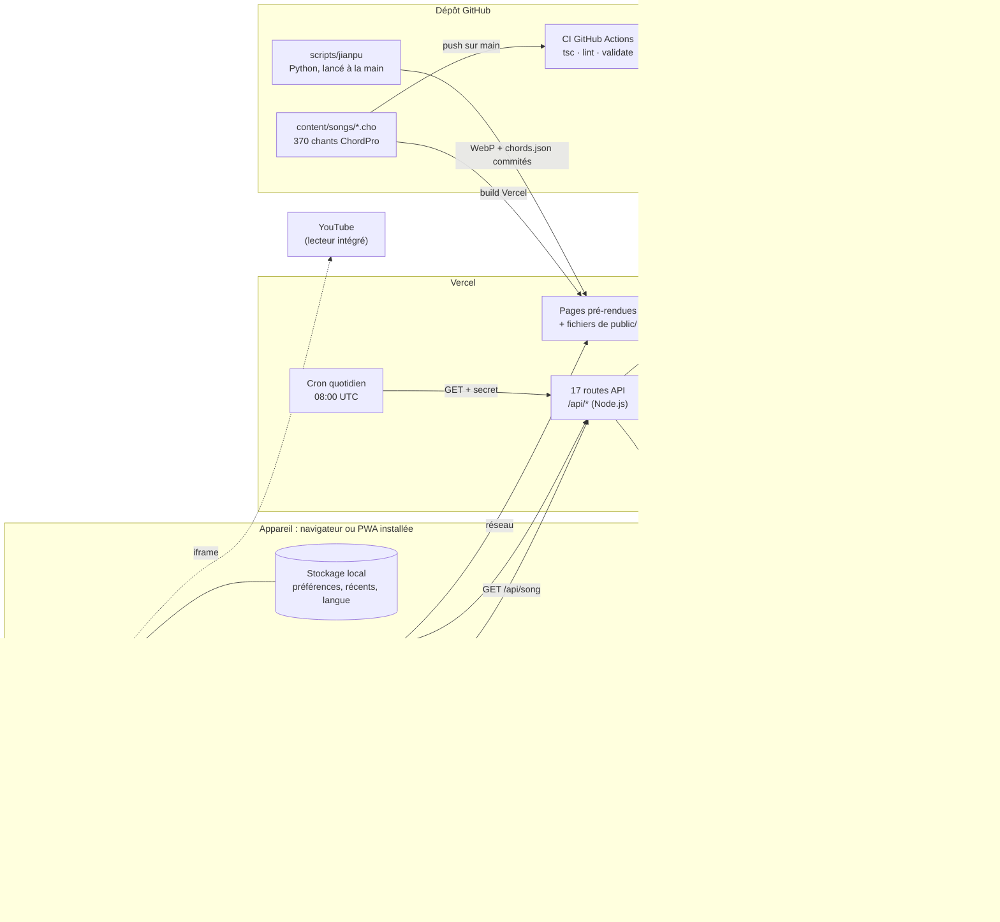
```mermaid
flowchart LR
  subgraph APPAREIL["Appareil : navigateur ou PWA installée"]
    UI["Pages Next.js<br/>(React, rendu côté client)"]
    LS[("Stockage local<br/>préférences, récents, langue")]
    SW["Service worker<br/>public/sw.js"]
    CACHE[("Cache du service worker")]
  end

  subgraph VERCEL["Vercel"]
    STATIC["Pages pré-rendues<br/>+ fichiers de public/"]
    API["17 routes API<br/>/api/* (Node.js)"]
    CRON["Cron quotidien<br/>08:00 UTC"]
  end

  subgraph FIREBASE["Firebase"]
    AUTH["Firebase Auth<br/>email + mot de passe"]
    FS[("Firestore<br/>setlists, profils, push…")]
  end

  SHEET["Google Sheet du planning<br/>(CSV public)"]
  PUSHSRV["Services push des navigateurs<br/>Apple · Google · Mozilla"]
  YT["YouTube<br/>(lecteur intégré)"]

  subgraph DEPOT["Dépôt GitHub"]
    CHO["content/songs/*.cho<br/>370 chants ChordPro"]
    JPY["scripts/jianpu<br/>Python, lancé à la main"]
    CI["CI GitHub Actions<br/>tsc · lint · validate"]
  end

  UI -->|"GET même origine"| SW
  SW <-->|"lit / écrit"| CACHE
  SW -->|"réseau"| STATIC
  SW -->|"GET /api/song"| API
  UI --- LS
  UI -->|"REST + jeton, jamais en cache"| FS
  UI -->|"connexion"| AUTH
  UI -->|"POST + jeton"| API
  UI -->|"CSV"| SHEET
  UI -.->|"iframe"| YT
  API -->|"Admin SDK"| FS
  API -->|"vérifie le jeton"| AUTH
  API -->|"web-push (VAPID)"| PUSHSRV
  PUSHSRV -->|"événement push"| SW
  CRON -->|"GET + secret"| API
  API -->|"CSV (rappels, destinataires)"| SHEET
  CHO -->|"build Vercel"| STATIC
  JPY -->|"WebP + chords.json commités"| STATIC
  CHO -->|"push sur main"| CI
```

[SVG](diagrammes/01-architecture.svg)

## Parcours

### De l'ouverture de l'app au culte

Le chemin d'un membre de l'équipe louange. Sans compte, on voit les chants ; la connexion ouvre les setlists, le planning personnel et les notifications. La setlist se prépare en semaine, l'équipe est prévenue par push, et le jour J elle se joue en mode louange.

**Fichiers clés** : `src/app/manifest.ts`, `src/components/layout/MobileTabBar.tsx`, `src/app/(auth)/login/page.tsx`, `src/app/(auth)/signup/page.tsx`, `src/components/onboarding/Accueil.tsx`, `src/lib/access.ts`, `src/components/setlists/SetlistForm.tsx`, `src/components/performance/PerformanceMode.tsx`

> **Incertain** : En ligne, une personne sans compte n'a qu'un onglet (Chants) : la page /planning s'ouvre quand même si on y arrive par l'icône ou un lien.

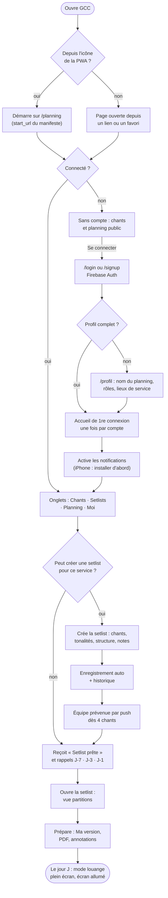
```mermaid
flowchart TD
  A(["Ouvre GCC"]) --> B{"Depuis l'icône<br/>de la PWA ?"}
  B -->|"oui"| C["Démarre sur /planning<br/>(start_url du manifeste)"]
  B -->|"non"| D["Page ouverte depuis<br/>un lien ou un favori"]
  C --> E{"Connecté ?"}
  D --> E
  E -->|"non"| F["Sans compte : chants<br/>et planning public"]
  F -->|"Se connecter"| G["/login ou /signup<br/>Firebase Auth"]
  G --> H{"Profil complet ?"}
  H -->|"non"| I["/profil : nom du planning,<br/>rôles, lieux de service"]
  H -->|"oui"| J["Accueil de 1re connexion<br/>une fois par compte"]
  I --> J
  J --> K["Active les notifications<br/>(iPhone : installer d'abord)"]
  E -->|"oui"| L["Onglets : Chants · Setlists<br/>· Planning · Moi"]
  K --> L
  L --> M{"Peut créer une setlist<br/>pour ce service ?"}
  M -->|"oui"| N["Crée la setlist : chants,<br/>tonalités, structure, notes"]
  N --> O["Enregistrement auto<br/>+ historique"]
  O --> P["Équipe prévenue par push<br/>dès 4 chants"]
  M -->|"non"| Q["Reçoit « Setlist prête »<br/>et rappels J-7 · J-3 · J-1"]
  P --> Q
  Q --> R["Ouvre la setlist :<br/>vue partitions"]
  R --> S["Prépare : Ma version,<br/>PDF, annotations"]
  S --> T(["Le jour J : mode louange<br/>plein écran, écran allumé"])
```

[SVG](diagrammes/02-parcours.svg)

## Fonctionnalités, de bout en bout

### Publier un chant

Un chant est un fichier ChordPro écrit à la main et poussé sur main. Deux chemins partent alors en parallèle : la CI GitHub vérifie (types, lint, validation des .cho), Vercel reconstruit le site. Au build, trois scripts produisent l'index des chants, les largeurs de glyphes du PDF et l'index Harmonie, puis Next.js pré-rend une page par chant.

**Fichiers clés** : `content/songs/`, `docs/chants/01-format-cho.md`, `scripts/build-index.ts`, `scripts/build-glyph-widths.ts`, `scripts/build-harmonie.ts`, `scripts/validate-songs.ts`, `src/app/songs/[slug]/page.tsx`, `.github/workflows/deploy.yml`, `package.json`

> **Incertain** : Le déploiement déclenché par l'intégration Git de Vercel n'est décrit nulle part dans le dépôt : vercel.json ne fixe que la commande de build et le cron. Qu'une CI rouge n'empêche pas la mise en ligne est déduit, à confirmer dans les réglages Vercel.

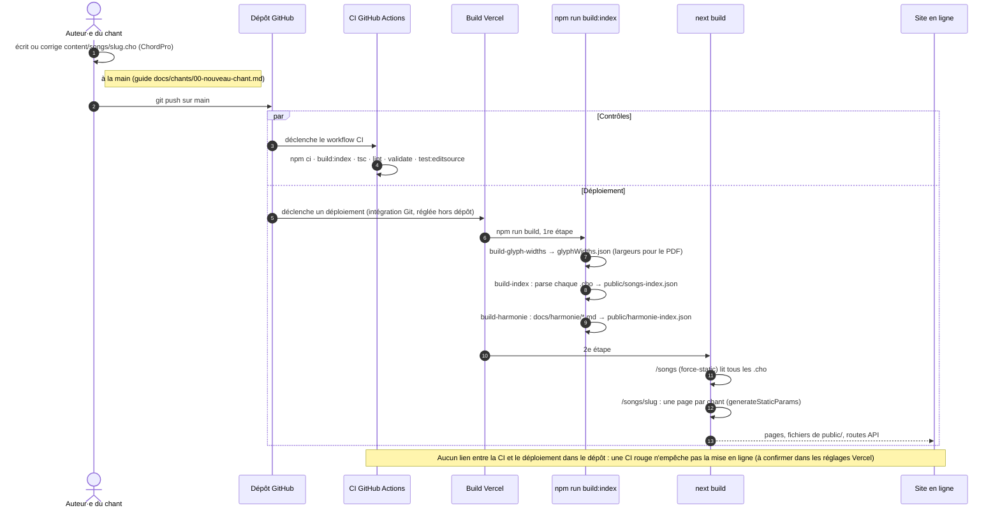
```mermaid
sequenceDiagram
  autonumber
  actor Auteur as Auteur·e du chant
  participant Git as Dépôt GitHub
  participant CI as CI GitHub Actions
  participant VB as Build Vercel
  participant IDX as npm run build:index
  participant NX as next build
  participant WEB as Site en ligne
  Auteur->>Auteur: écrit ou corrige content/songs/slug.cho (ChordPro)
  Note right of Auteur: à la main (guide docs/chants/00-nouveau-chant.md)
  Auteur->>Git: git push sur main
  par Contrôles
    Git->>CI: déclenche le workflow CI
    CI->>CI: npm ci · build:index · tsc · lint · validate · test:editsource
  and Déploiement
    Git->>VB: déclenche un déploiement (intégration Git, réglée hors dépôt)
    VB->>IDX: npm run build, 1re étape
    IDX->>IDX: build-glyph-widths → glyphWidths.json (largeurs pour le PDF)
    IDX->>IDX: build-index : parse chaque .cho → public/songs-index.json
    IDX->>IDX: build-harmonie : docs/harmonie/*.md → public/harmonie-index.json
    VB->>NX: 2e étape
    NX->>NX: /songs (force-static) lit tous les .cho
    NX->>NX: /songs/slug : une page par chant (generateStaticParams)
    NX-->>WEB: pages, fichiers de public/, routes API
  end
  Note over CI,WEB: Aucun lien entre la CI et le déploiement dans le dépôt : une CI rouge n'empêche pas la mise en ligne (à confirmer dans les réglages Vercel)
```

[SVG](diagrammes/10-publication-chants.svg)

### Trouver un chant

La liste est une page statique qui reçoit les 370 chants au build : aucun appel réseau au chargement. La recherche floue (Fuse.js) porte sur le titre, le pinyin et l'artiste, puis les filtres langue et thème s'appliquent. Filtres, récents et position de défilement survivent au retour grâce à l'URL et au stockage du navigateur.

**Fichiers clés** : `src/app/songs/page.tsx`, `src/app/songs/SongListClient.tsx`, `src/lib/content/loadSongs.ts`, `content/themes.json`, `src/types/song.ts`

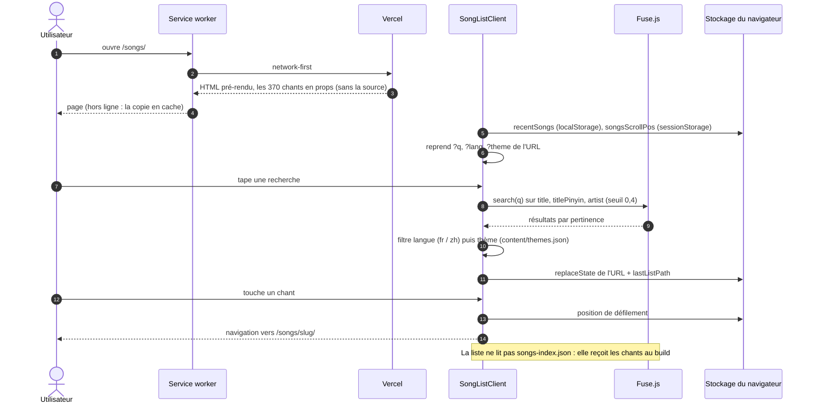
```mermaid
sequenceDiagram
  autonumber
  actor U as Utilisateur
  participant SW as Service worker
  participant V as Vercel
  participant L as SongListClient
  participant F as Fuse.js
  participant S as Stockage du navigateur
  U->>SW: ouvre /songs/
  SW->>V: network-first
  V-->>SW: HTML pré-rendu, les 370 chants en props (sans la source)
  SW-->>U: page (hors ligne : la copie en cache)
  L->>S: recentSongs (localStorage), songsScrollPos (sessionStorage)
  L->>L: reprend ?q, ?lang, ?theme de l'URL
  U->>L: tape une recherche
  L->>F: search(q) sur title, titlePinyin, artist (seuil 0,4)
  F-->>L: résultats par pertinence
  L->>L: filtre langue (fr / zh) puis thème (content/themes.json)
  L->>S: replaceState de l'URL + lastListPath
  U->>L: touche un chant
  L->>S: position de défilement
  L-->>U: navigation vers /songs/slug/
  Note over L,F: La liste ne lit pas songs-index.json : elle reçoit les chants au build
```

[SVG](diagrammes/11-recherche-chants.svg)

### Afficher et transposer un chant

La page arrive avec la source ChordPro complète : analyse et transposition se font dans le navigateur, sans appel réseau quand on change de tonalité. La tonalité par défaut est la recommandée, la plus chantée à GCC. Pour les 185 chants qui ont une partition 简谱, le scan s'affiche avec un calque qui réécrit les accords dans la tonalité choisie.

**Fichiers clés** : `src/app/songs/[slug]/page.tsx`, `src/app/songs/[slug]/SongDetailClient.tsx`, `src/lib/chordpro/parser.ts`, `src/lib/transposeAST.ts`, `src/lib/transpose.ts`, `src/components/song/SongView.tsx`, `src/components/jianpu/JianpuSheet.tsx`, `src/lib/jianpu/images.ts`

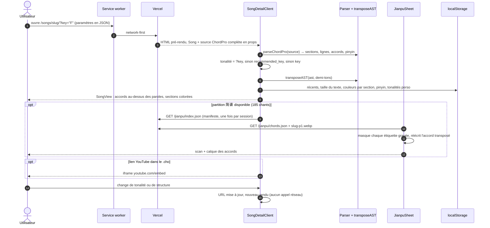
```mermaid
sequenceDiagram
  autonumber
  actor U as Utilisateur
  participant SW as Service worker
  participant V as Vercel
  participant D as SongDetailClient
  participant P as Parser + transposeAST
  participant J as JianpuSheet
  participant S as localStorage
  U->>SW: ouvre /songs/slug/?key="F" (paramètres en JSON)
  SW->>V: network-first
  V-->>D: HTML pré-rendu, Song + source ChordPro complète en props
  D->>P: parseChordPro(source) → sections, lignes, accords, pinyin
  D->>D: tonalité = ?key, sinon recommended_key, sinon key
  D->>P: transposeAST(ast, demi-tons)
  D->>S: récents, taille du texte, couleurs par section, pinyin, tonalités perso
  D-->>U: SongView : accords au-dessus des paroles, sections colorées
  opt partition 简谱 disponible (185 chants)
    D->>V: GET /jianpu/index.json (manifeste, une fois par session)
    J->>V: GET /jianpu/chords.json + slug-p1.webp
    J->>J: masque chaque étiquette gravée, réécrit l'accord transposé
    J-->>U: scan + calque des accords
  end
  opt lien YouTube dans le .cho
    D-->>U: iframe youtube.com/embed
  end
  U->>D: change de tonalité ou de structure
  D->>D: URL mise à jour, nouveau rendu (aucun appel réseau)
```

[SVG](diagrammes/12-page-chant.svg)

### Compte, profil et droits

L'identité passe par Firebase Auth (email et mot de passe). Le profil (nom tel qu'il est écrit dans le planning, rôles par service, droits) est un document users/uid. Les droits sont calculés deux fois : dans l'interface par src/lib/access.ts, côté Firestore par firestore.rules, qu'il faut publier à la main dans la console Firebase.

**Fichiers clés** : `src/lib/firebase/auth.ts`, `src/lib/firebase/users.ts`, `src/lib/access.ts`, `firestore.rules`, `src/app/(auth)/signup/page.tsx`, `src/app/(auth)/login/page.tsx`, `src/app/(auth)/profil/page.tsx`

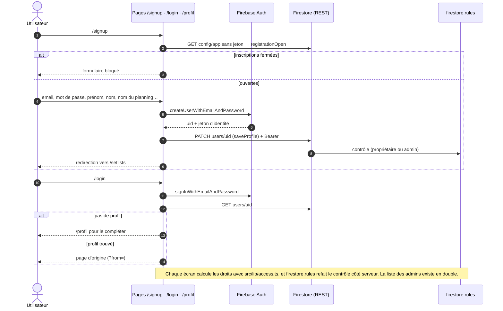
```mermaid
sequenceDiagram
  autonumber
  actor U as Utilisateur
  participant P as Pages /signup · /login · /profil
  participant A as Firebase Auth
  participant FS as Firestore (REST)
  participant R as firestore.rules
  U->>P: /signup
  P->>FS: GET config/app sans jeton → registrationOpen
  alt inscriptions fermées
    P-->>U: formulaire bloqué
  else ouvertes
    U->>P: email, mot de passe, prénom, nom, nom du planning…
    P->>A: createUserWithEmailAndPassword
    A-->>P: uid + jeton d'identité
    P->>FS: PATCH users/uid (saveProfile) + Bearer
    FS->>R: contrôle (propriétaire ou admin)
    P-->>U: redirection vers /setlists
  end
  U->>P: /login
  P->>A: signInWithEmailAndPassword
  P->>FS: GET users/uid
  alt pas de profil
    P-->>U: /profil pour le compléter
  else profil trouvé
    P-->>U: page d'origine (?from=)
  end
  Note over P,R: Chaque écran calcule les droits avec src/lib/access.ts, et firestore.rules refait le contrôle côté serveur. La liste des admins existe en double.
```

[SVG](diagrammes/13-connexion.svg)

### Planifier une setlist

L'éditeur enregistre tout seul, deux secondes après chaque changement : un brouillon invisible à la création, puis des modifications suivies dans un historique. À la publication et en quittant l'éditeur, il demande au serveur de prévenir l'équipe ; le serveur n'envoie qu'une fois, et seulement à partir de quatre chants.

**Fichiers clés** : `src/components/setlists/SetlistForm.tsx`, `src/app/setlists/new/CreateSetlistClient.tsx`, `src/app/setlists/[id]/edit/EditSetlistClient.tsx`, `src/lib/firebase/setlists.ts`, `src/lib/firebase/setlistHistory.ts`, `src/lib/setlist/history.ts`, `src/app/api/push/notify-setlist/route.ts`

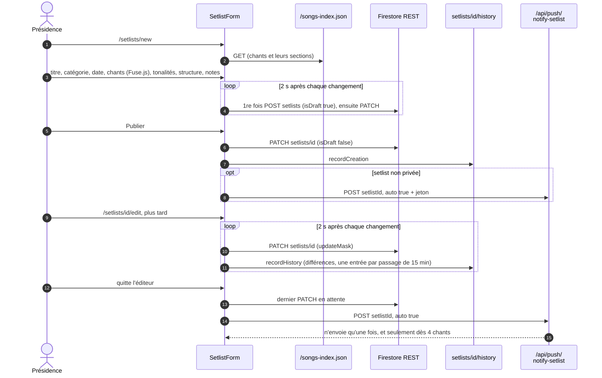
```mermaid
sequenceDiagram
  autonumber
  actor Pr as Présidence
  participant F as SetlistForm
  participant I as /songs-index.json
  participant FS as Firestore REST
  participant H as setlists/id/history
  participant API as /api/push/<br/>notify-setlist
  Pr->>F: /setlists/new
  F->>I: GET (chants et leurs sections)
  Pr->>F: titre, catégorie, date, chants (Fuse.js), tonalités, structure, notes
  loop 2 s après chaque changement
    F->>FS: 1re fois POST setlists (isDraft true), ensuite PATCH
  end
  Pr->>F: Publier
  F->>FS: PATCH setlists/id (isDraft false)
  F->>H: recordCreation
  opt setlist non privée
    F->>API: POST setlistId, auto true + jeton
  end
  Pr->>F: /setlists/id/edit, plus tard
  loop 2 s après chaque changement
    F->>FS: PATCH setlists/id (updateMask)
    F->>H: recordHistory (différences, une entrée par passage de 15 min)
  end
  Pr->>F: quitte l'éditeur
  F->>FS: dernier PATCH en attente
  F->>API: POST setlistId, auto true
  API-->>F: n'envoie qu'une fois, et seulement dès 4 chants
```

[SVG](diagrammes/14-setlist-edition.svg)

### La setlist en live

Sur la page d'une setlist, la vue Partitions charge chaque chant par /api/song, puis applique les adaptations (mode Adapter, Ma version) et les tonalités. Le mode louange découpe le tout en pages plein écran, garde l'écran allumé et enregistre les annotations dessinées dans Firestore.

**Fichiers clés** : `src/app/setlists/[id]/SetlistDetailClient.tsx`, `src/lib/api/songs.ts`, `src/app/api/song/[slug]/route.ts`, `src/lib/chordpro/itemContent.ts`, `src/lib/firebase/setlistVersions.ts`, `src/components/performance/PerformanceMode.tsx`, `src/lib/performance/blocks.ts`, `src/lib/firebase/annotations.ts`

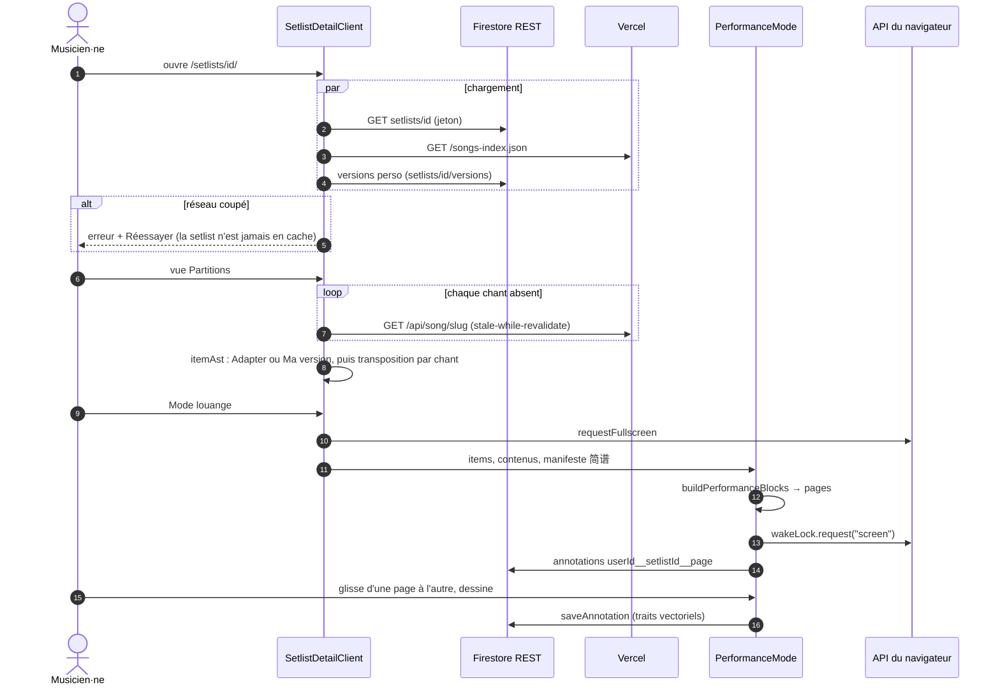
```mermaid
sequenceDiagram
  autonumber
  actor M as Musicien·ne
  participant D as SetlistDetailClient
  participant FS as Firestore REST
  participant V as Vercel
  participant PM as PerformanceMode
  participant N as API du navigateur
  M->>D: ouvre /setlists/id/
  par chargement
    D->>FS: GET setlists/id (jeton)
    D->>V: GET /songs-index.json
    D->>FS: versions perso (setlists/id/versions)
  end
  alt réseau coupé
    D-->>M: erreur + Réessayer (la setlist n'est jamais en cache)
  end
  M->>D: vue Partitions
  loop chaque chant absent
    D->>V: GET /api/song/slug (stale-while-revalidate)
  end
  D->>D: itemAst : Adapter ou Ma version, puis transposition par chant
  M->>D: Mode louange
  D->>N: requestFullscreen
  D->>PM: items, contenus, manifeste 简谱
  PM->>PM: buildPerformanceBlocks → pages
  PM->>N: wakeLock.request("screen")
  PM->>FS: annotations userId__setlistId__page
  M->>PM: glisse d'une page à l'autre, dessine
  PM->>FS: saveAnnotation (traits vectoriels)
```

[SVG](diagrammes/15-setlist-live.svg)

### S'abonner aux notifications

Le navigateur crée un abonnement auprès de son service push (Apple, Google ou Mozilla) avec la clé publique VAPID, puis l'enregistre dans Firestore sous un identifiant tiré du compte et de l'appareil. Sur iPhone, le push n'existe que dans l'app installée sur l'écran d'accueil : l'interface le dit et s'arrête là.

**Fichiers clés** : `src/lib/push/client.ts`, `src/components/push/PushToggle.tsx`, `src/components/push/PushPrompt.tsx`, `src/components/onboarding/Accueil.tsx`, `src/lib/firebase/notifPrefs.ts`, `public/sw.js`

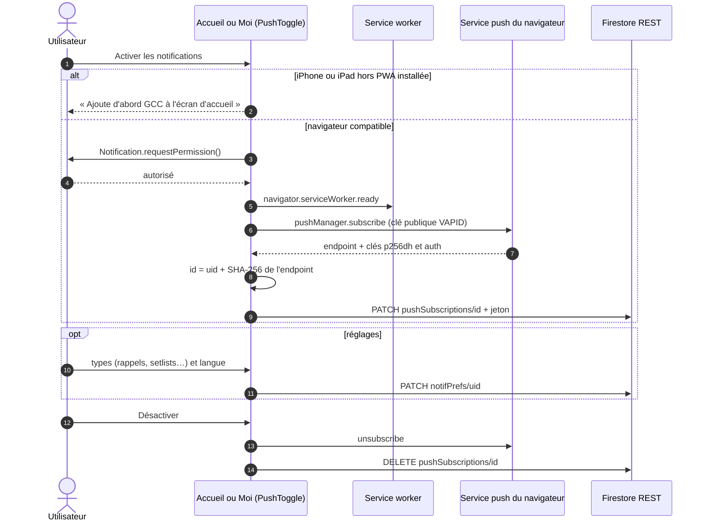
```mermaid
sequenceDiagram
  autonumber
  actor U as Utilisateur
  participant UI as Accueil ou Moi (PushToggle)
  participant SW as Service worker
  participant PS as Service push du navigateur
  participant FS as Firestore REST
  U->>UI: Activer les notifications
  alt iPhone ou iPad hors PWA installée
    UI-->>U: « Ajoute d'abord GCC à l'écran d'accueil »
  else navigateur compatible
    UI->>U: Notification.requestPermission()
    U-->>UI: autorisé
    UI->>SW: navigator.serviceWorker.ready
    UI->>PS: pushManager.subscribe (clé publique VAPID)
    PS-->>UI: endpoint + clés p256dh et auth
    UI->>UI: id = uid + SHA-256 de l'endpoint
    UI->>FS: PATCH pushSubscriptions/id + jeton
  end
  opt réglages
    U->>UI: types (rappels, setlists…) et langue
    UI->>FS: PATCH notifPrefs/uid
  end
  U->>UI: Désactiver
  UI->>PS: unsubscribe
  UI->>FS: DELETE pushSubscriptions/id
```

[SVG](diagrammes/16-push-abonnement.svg)

### Notification « Setlist prête »

Le serveur vérifie l'appelant et la setlist, retrouve dans le Google Sheet qui sert ce jour-là, relie ces noms aux comptes, puis envoie un push à chaque appareil abonné. Les abonnements morts (404, 410) sont supprimés au passage. Au clic, le service worker ramène l'app au premier plan sur la bonne page.

**Fichiers clés** : `src/app/api/push/notify-setlist/route.ts`, `src/lib/push/send.ts`, `src/lib/push/recipients.ts`, `src/lib/push/messages.ts`, `src/lib/planning/names.ts`, `public/sw.js`

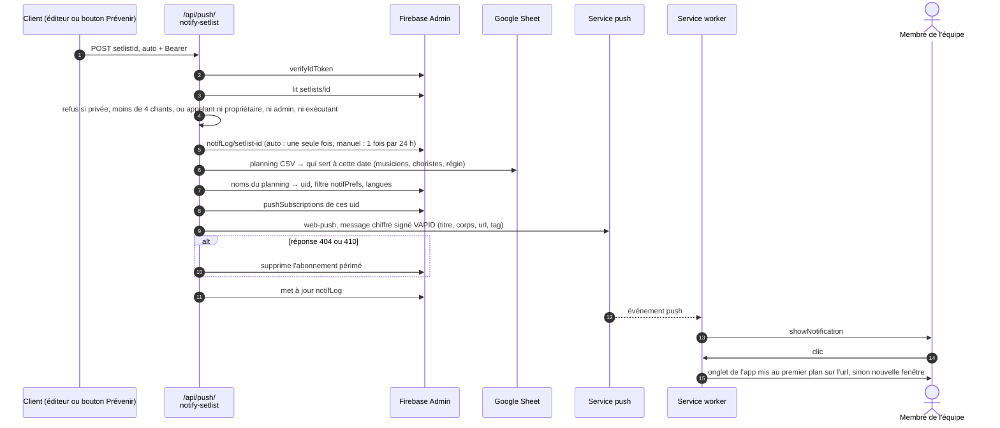
```mermaid
sequenceDiagram
  autonumber
  participant C as Client (éditeur ou bouton Prévenir)
  participant API as /api/push/<br/>notify-setlist
  participant AD as Firebase Admin
  participant SH as Google Sheet
  participant PS as Service push
  participant SW as Service worker
  actor M as Membre de l'équipe
  C->>API: POST setlistId, auto + Bearer
  API->>AD: verifyIdToken
  API->>AD: lit setlists/id
  API->>API: refus si privée, moins de 4 chants, ou appelant ni propriétaire, ni admin, ni exécutant
  API->>AD: notifLog/setlist-id (auto : une seule fois, manuel : 1 fois par 24 h)
  API->>SH: planning CSV → qui sert à cette date (musiciens, choristes, régie)
  API->>AD: noms du planning → uid, filtre notifPrefs, langues
  API->>AD: pushSubscriptions de ces uid
  API->>PS: web-push, message chiffré signé VAPID (titre, corps, url, tag)
  alt réponse 404 ou 410
    API->>AD: supprime l'abonnement périmé
  end
  API->>AD: met à jour notifLog
  PS-->>SW: événement push
  SW->>M: showNotification
  M->>SW: clic
  SW->>M: onglet de l'app mis au premier plan sur l'url, sinon nouvelle fenêtre
```

[SVG](diagrammes/17-push-setlist.svg)

### Rappels quotidiens

Un seul cron Vercel, chaque jour à 08:00 UTC. Il lit le planning, compose pour chaque personne un seul message qui liste ses services à J-7, J-3 et J-1, dans sa langue, et note chaque envoi pour ne jamais doubler. Les rappels du back-office (scène, tâches, évènements) ne partent que si l'interrupteur est allumé.

**Fichiers clés** : `vercel.json`, `src/app/api/cron/reminders/route.ts`, `src/lib/push/reminderMessage.ts`, `src/lib/push/notifications.ts`, `src/lib/push/recipients.ts`, `src/lib/backOffice.ts`

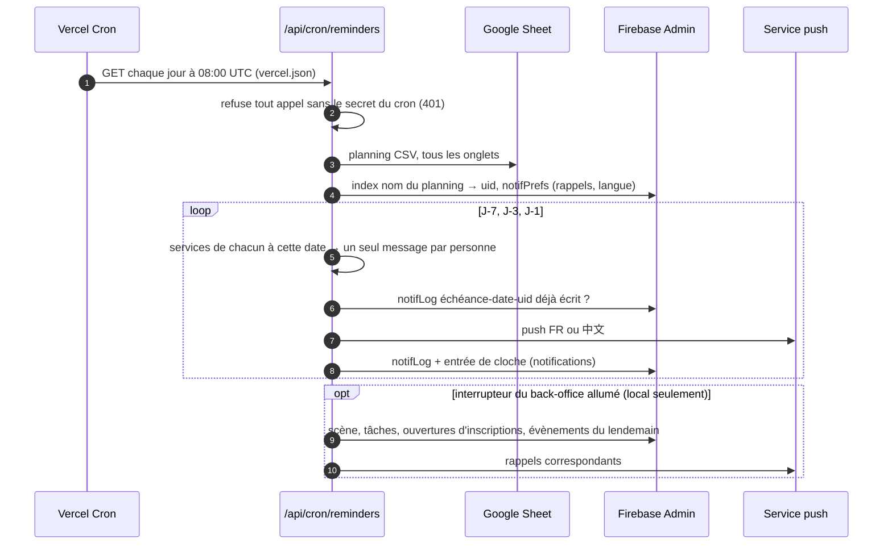
```mermaid
sequenceDiagram
  autonumber
  participant VC as Vercel Cron
  participant R as /api/cron/reminders
  participant SH as Google Sheet
  participant AD as Firebase Admin
  participant PS as Service push
  VC->>R: GET chaque jour à 08:00 UTC (vercel.json)
  R->>R: refuse tout appel sans le secret du cron (401)
  R->>SH: planning CSV, tous les onglets
  R->>AD: index nom du planning → uid, notifPrefs (rappels, langue)
  loop J-7, J-3, J-1
    R->>R: services de chacun à cette date → un seul message par personne
    R->>AD: notifLog échéance-date-uid déjà écrit ?
    R->>PS: push FR ou 中文
    R->>AD: notifLog + entrée de cloche (notifications)
  end
  opt interrupteur du back-office allumé (local seulement)
    R->>AD: scène, tâches, ouvertures d'inscriptions, évènements du lendemain
    R->>PS: rappels correspondants
  end
```

[SVG](diagrammes/18-rappels-cron.svg)

### Exporter en PDF

Le PDF est fabriqué dans le navigateur par @react-pdf/renderer, chargé seulement au clic. En style classique, la couleur suit la langue du chant : bleu pour le français, rouge pour le chinois ; le style « couleurs par section » reprend les couleurs de l'écran. Pour une setlist, les scans 简谱, servis en WebP que react-pdf ne sait pas lire, sont ré-encodés en PNG.

**Fichiers clés** : `src/components/pdf/SongPDF.tsx`, `src/components/pdf/SetlistFullPDF.tsx`, `src/components/pdf/SetlistOverviewPDF.tsx`, `src/components/pdf/PlanningPDF.tsx`, `src/components/pdf/PdfChoiceSheet.tsx`, `src/lib/pdfStylePref.ts`, `src/lib/pdf/colors.ts`, `public/fonts/`

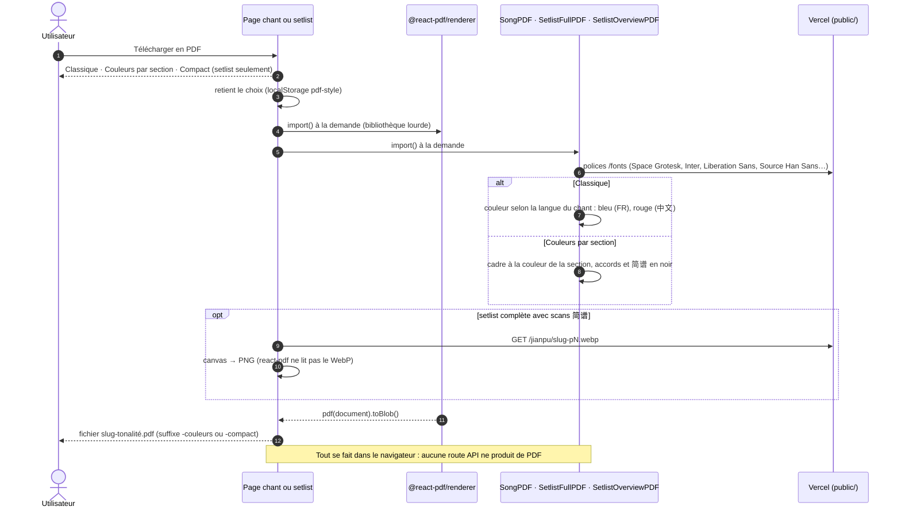
```mermaid
sequenceDiagram
  autonumber
  actor U as Utilisateur
  participant D as Page chant ou setlist
  participant RP as @react-pdf/renderer
  participant T as SongPDF · SetlistFullPDF · SetlistOverviewPDF
  participant V as Vercel (public/)
  U->>D: Télécharger en PDF
  D-->>U: Classique · Couleurs par section · Compact (setlist seulement)
  D->>D: retient le choix (localStorage pdf-style)
  D->>RP: import() à la demande (bibliothèque lourde)
  D->>T: import() à la demande
  T->>V: polices /fonts (Space Grotesk, Inter, Liberation Sans, Source Han Sans…)
  alt Classique
    T->>T: couleur selon la langue du chant : bleu (FR), rouge (中文)
  else Couleurs par section
    T->>T: cadre à la couleur de la section, accords et 简谱 en noir
  end
  opt setlist complète avec scans 简谱
    D->>V: GET /jianpu/slug-pN.webp
    D->>D: canvas → PNG (react-pdf ne lit pas le WebP)
  end
  RP-->>D: pdf(document).toBlob()
  D-->>U: fichier slug-tonalité.pdf (suffixe -couleurs ou -compact)
  Note over D,T: Tout se fait dans le navigateur : aucune route API ne produit de PDF
```

[SVG](diagrammes/19-pdf.svg)

### Pipeline 简谱

Les partitions chinoises sont des scans : les chiffres restent des pixels, justes dans toutes les tonalités. Des scripts Python découpent chaque page, lisent les étiquettes d'accords en les choisissant parmi les accords du .cho, et publient leurs positions dans chords.json ; une vérité terrain relue à l'œil passe devant la lecture automatique. Rien de cela ne tourne au build : les fichiers produits sont commités, et le navigateur se contente de masquer puis réécrire chaque accord.

**Fichiers clés** : `scripts/jianpu/LOOP.md`, `scripts/jianpu/build-images.py`, `scripts/jianpu/segment.py`, `scripts/jianpu/classify.py`, `scripts/jianpu/match.py`, `scripts/jianpu/build-chords.py`, `scripts/jianpu/freeze.py`, `scripts/jianpu/audit-browser.ts`, `public/jianpu/`, `src/components/jianpu/JianpuSheet.tsx`

> **Incertain** : Les scans sources vivent hors du dépôt (build-images.py les attend dans ../Partitions) : les premières étapes ne se refont pas depuis un clone seul.

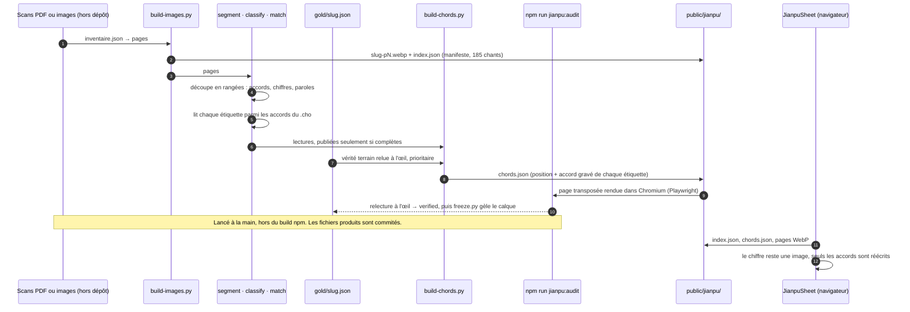
```mermaid
sequenceDiagram
  autonumber
  participant SRC as Scans PDF ou images (hors dépôt)
  participant BI as build-images.py
  participant LEC as segment · classify · match
  participant GOLD as gold/slug.json
  participant BC as build-chords.py
  participant AUD as npm run jianpu:audit
  participant PUB as public/jianpu/
  participant JS as JianpuSheet (navigateur)
  SRC->>BI: inventaire.json → pages
  BI->>PUB: slug-pN.webp + index.json (manifeste, 185 chants)
  BI->>LEC: pages
  LEC->>LEC: découpe en rangées : accords, chiffres, paroles
  LEC->>LEC: lit chaque étiquette parmi les accords du .cho
  LEC->>BC: lectures, publiées seulement si complètes
  GOLD->>BC: vérité terrain relue à l'œil, prioritaire
  BC->>PUB: chords.json (position + accord gravé de chaque étiquette)
  PUB->>AUD: page transposée rendue dans Chromium (Playwright)
  AUD-->>GOLD: relecture à l'œil → verified, puis freeze.py gèle le calque
  Note over SRC,AUD: Lancé à la main, hors du build npm. Les fichiers produits sont commités.
  JS->>PUB: index.json, chords.json, pages WebP
  JS->>JS: le chiffre reste une image, seuls les accords sont réécrits
```

[SVG](diagrammes/20-jianpu-pipeline.svg)

### Service worker, cache et hors-ligne

Le service worker est enregistré par un script en ligne dans layout.tsx. Les pages passent d'abord par le réseau pour ne jamais servir un déploiement périmé ; les fichiers hashés de Next.js viennent d'abord du cache ; l'index des chants, les polices et le contenu des chants sont servis tout de suite puis rafraîchis en fond. Sur un serveur local, rien n'est mis en cache.

**Fichiers clés** : `public/sw.js`, `src/app/layout.tsx`, `src/app/manifest.ts`, `vercel.json`

> **Incertain** : Ce qui marche hors ligne dépend des pages déjà visitées : seules /songs/ et songs-index.json sont préchargées à l'installation.

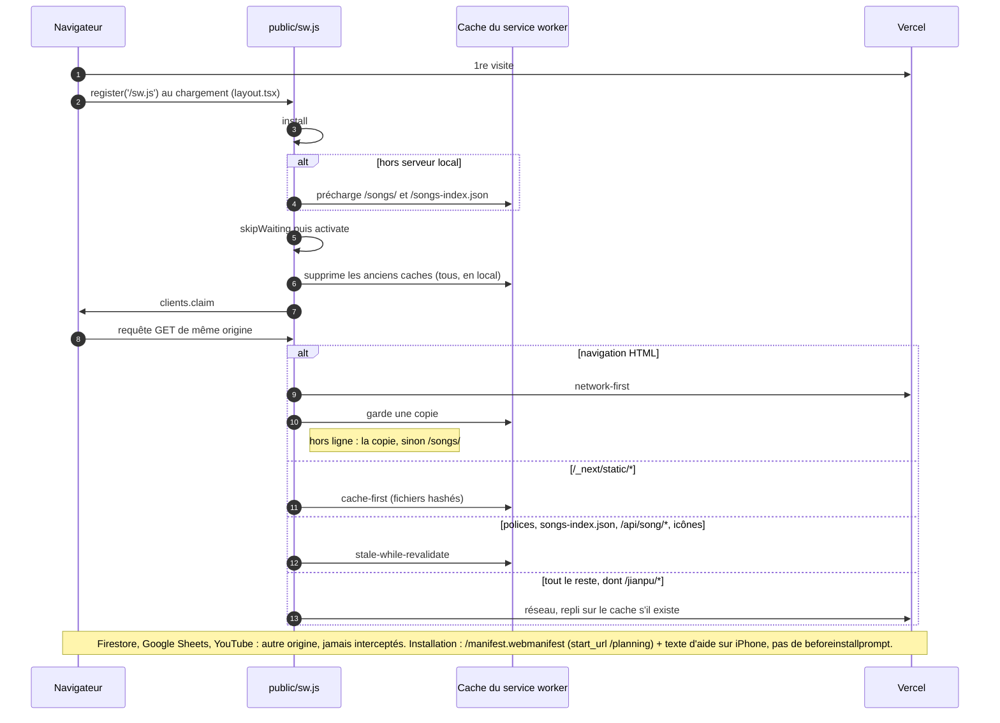
```mermaid
sequenceDiagram
  autonumber
  participant N as Navigateur
  participant SW as public/sw.js
  participant C as Cache du service worker
  participant V as Vercel
  N->>V: 1re visite
  N->>SW: register('/sw.js') au chargement (layout.tsx)
  SW->>SW: install
  alt hors serveur local
    SW->>C: précharge /songs/ et /songs-index.json
  end
  SW->>SW: skipWaiting puis activate
  SW->>C: supprime les anciens caches (tous, en local)
  SW->>N: clients.claim
  N->>SW: requête GET de même origine
  alt navigation HTML
    SW->>V: network-first
    SW->>C: garde une copie
    Note right of SW: hors ligne : la copie, sinon /songs/
  else /_next/static/*
    SW->>C: cache-first (fichiers hashés)
  else polices, songs-index.json, /api/song/*, icônes
    SW->>C: stale-while-revalidate
  else tout le reste, dont /jianpu/*
    SW->>V: réseau, repli sur le cache s'il existe
  end
  Note over N,V: Firestore, Google Sheets, YouTube : autre origine, jamais interceptés. Installation : /manifest.webmanifest (start_url /planning) + texte d'aide sur iPhone, pas de beforeinstallprompt.
```

[SVG](diagrammes/21-pwa-cache.svg)

### Ajouter un chant : ce qui existe vraiment

Il n'y a ni import ni transcription automatique dans le code. Un membre peut proposer un chant (titre, lien YouTube, lien vers le PDF), et la proposition arrive dans /admin. La conversion en .cho se fait ensuite à la main, hors du site : la spec qui l'automatiserait est « en attente » depuis le 10 juin 2026.

**Fichiers clés** : `src/components/songs/SongProposalDrawer.tsx`, `src/lib/firebase/songProposals.ts`, `src/app/admin/page.tsx`, `docs/spec-ajouter-un-chant.md`, `CHORDPRO_GUIDELINES.md`

> **Incertain** : L'étape « l'admin fait convertir le chant » n'existe dans aucun code : elle décrit la pratique (session Claude Code, skill chord-placement), pas un mécanisme.

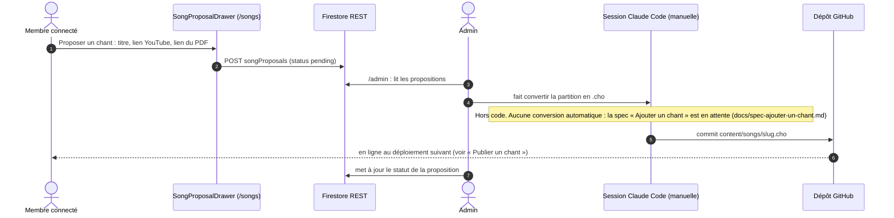
```mermaid
sequenceDiagram
  autonumber
  actor U as Membre connecté
  participant D as SongProposalDrawer (/songs)
  participant FS as Firestore REST
  actor A as Admin
  participant CC as Session Claude Code (manuelle)
  participant G as Dépôt GitHub
  U->>D: Proposer un chant : titre, lien YouTube, lien du PDF
  D->>FS: POST songProposals (status pending)
  A->>FS: /admin : lit les propositions
  A->>CC: fait convertir la partition en .cho
  Note over CC: Hors code. Aucune conversion automatique : la spec « Ajouter un chant » est en attente (docs/spec-ajouter-un-chant.md)
  CC->>G: commit content/songs/slug.cho
  G-->>U: en ligne au déploiement suivant (voir « Publier un chant »)
  A->>FS: met à jour le statut de la proposition
```

[SVG](diagrammes/22-ajout-chant.svg)

### Planning

Le planning vient d'un Google Sheet public, lu en CSV onglet par onglet, directement depuis le navigateur. En local, où l'interrupteur du back-office est allumé, une grille écrite dans l'app (Firestore) passe devant le Sheet ; en ligne, seul le Sheet compte. Publier un trimestre révèle son onglet aux membres et, la première fois seulement, envoie un push.

**Fichiers clés** : `src/app/planning/page.tsx`, `src/lib/planning/sheets.ts`, `src/lib/planning/grille.ts`, `src/lib/firebase/planningGrille.ts`, `src/app/api/planning/release/route.ts`, `src/lib/planning/names.ts`, `src/lib/backOffice.ts`

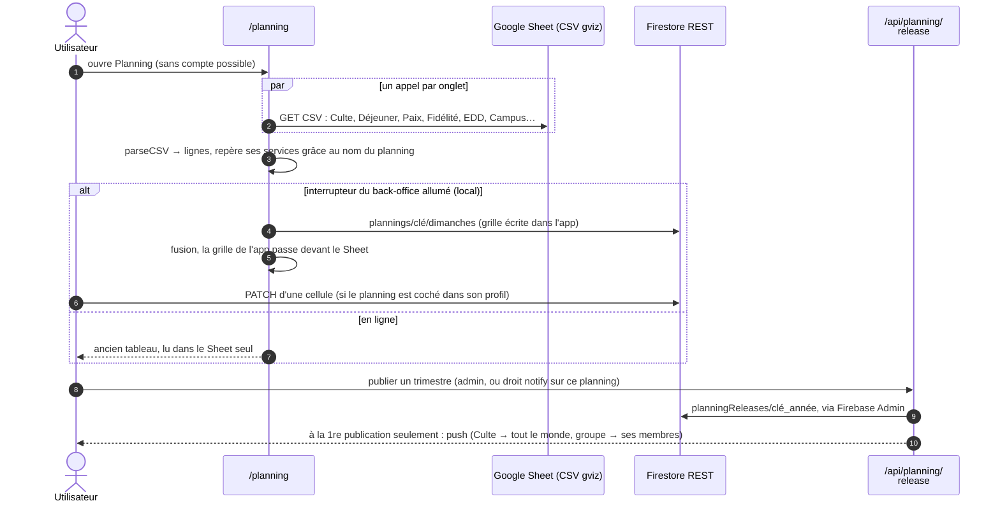
```mermaid
sequenceDiagram
  autonumber
  actor U as Utilisateur
  participant P as /planning
  participant SH as Google Sheet (CSV gviz)
  participant FS as Firestore REST
  participant API as /api/planning/<br/>release
  U->>P: ouvre Planning (sans compte possible)
  par un appel par onglet
    P->>SH: GET CSV : Culte, Déjeuner, Paix, Fidélité, EDD, Campus…
  end
  P->>P: parseCSV → lignes, repère ses services grâce au nom du planning
  alt interrupteur du back-office allumé (local)
    P->>FS: plannings/clé/dimanches (grille écrite dans l'app)
    P->>P: fusion, la grille de l'app passe devant le Sheet
    U->>FS: PATCH d'une cellule (si le planning est coché dans son profil)
  else en ligne
    P-->>U: ancien tableau, lu dans le Sheet seul
  end
  U->>API: publier un trimestre (admin, ou droit notify sur ce planning)
  API->>FS: planningReleases/clé_année, via Firebase Admin
  API-->>U: à la 1re publication seulement : push (Culte → tout le monde, groupe → ses membres)
```

[SVG](diagrammes/23-planning.svg)

### Signaler un problème

Un membre connecté peut signaler un problème sur un chant ou sur le site. Le serveur limite le débit par IP, valide le texte, enregistre le signalement dans Firestore et prévient les admins par push. Aucun email n'est envoyé.

**Fichiers clés** : `src/components/report/ReportDialog.tsx`, `src/app/api/report/route.ts`, `src/lib/report/reportValidator.ts`, `src/lib/push/recipients.ts`, `src/lib/firebase/reports.ts`, `src/app/admin/page.tsx`

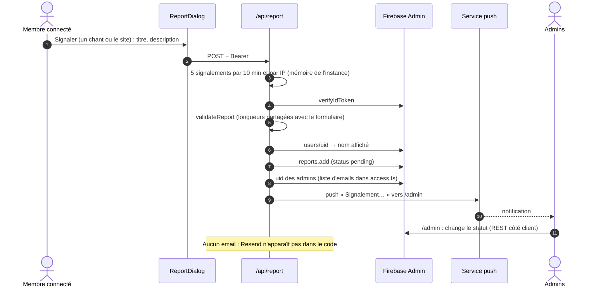
```mermaid
sequenceDiagram
  autonumber
  actor U as Membre connecté
  participant R as ReportDialog
  participant API as /api/report
  participant AD as Firebase Admin
  participant PS as Service push
  actor A as Admins
  U->>R: Signaler (un chant ou le site) : titre, description
  R->>API: POST + Bearer
  API->>API: 5 signalements par 10 min et par IP (mémoire de l'instance)
  API->>AD: verifyIdToken
  API->>API: validateReport (longueurs partagées avec le formulaire)
  API->>AD: users/uid → nom affiché
  API->>AD: reports.add (status pending)
  API->>AD: uid des admins (liste d'emails dans access.ts)
  API->>PS: push « Signalement… » vers /admin
  PS-->>A: notification
  A->>AD: /admin : change le statut (REST côté client)
  Note over API: Aucun email : Resend n'apparaît pas dans le code
```

[SVG](diagrammes/24-signalement.svg)

### Évènements : s'inscrire

Fonction du back-office, coupée en ligne : pages et routes répondent 404 tant que l'interrupteur n'est pas posé sur Vercel. L'inscription passe par une route serveur pour que la place et le compteur s'écrivent dans une même transaction ; on peut s'inscrire sans compte si l'organisateur l'autorise.

**Fichiers clés** : `src/app/evenements/[id]/`, `src/app/api/evenements/inscription/route.ts`, `src/lib/evenements/agenda.ts`, `src/lib/evenements/serveur.ts`, `src/lib/firebase/evenements.ts`, `src/lib/backOffice.ts`

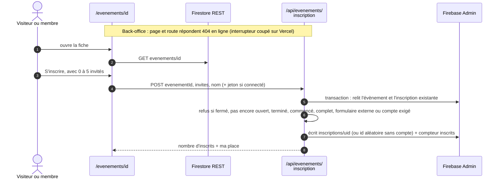
```mermaid
sequenceDiagram
  autonumber
  actor U as Visiteur ou membre
  participant E as /evenements/id
  participant FS as Firestore REST
  participant API as /api/evenements/<br/>inscription
  participant AD as Firebase Admin
  Note over E,API: Back-office : page et route répondent 404 en ligne (interrupteur coupé sur Vercel)
  U->>E: ouvre la fiche
  E->>FS: GET evenements/id
  U->>E: S'inscrire, avec 0 à 5 invités
  E->>API: POST evenementId, invites, nom (+ jeton si connecté)
  API->>AD: transaction : relit l'évènement et l'inscription existante
  API->>API: refus si fermé, pas encore ouvert, terminé, commencé, complet, formulaire externe ou compte exigé
  API->>AD: écrit inscriptions/uid (ou id aléatoire sans compte) + compteur inscrits
  API-->>E: nombre d'inscrits + ma place
```

[SVG](diagrammes/25-evenements.svg)

### Harmonie

Les fiches d'harmonie sont écrites en Markdown dans docs/harmonie et compilées au build ; une coquille dans une fiche fait échouer le build. Sur un chant, les suggestions sont calculées dans le navigateur à partir de ces règles ; l'équipe peut écarter une suggestion pour tout le monde ou écrire ses propres idées, gardées dans Firestore.

**Fichiers clés** : `scripts/build-harmonie.ts`, `docs/harmonie/`, `public/harmonie-index.json`, `src/lib/harmonie/useHarmonie.ts`, `src/lib/harmonie/suggestions.ts`, `src/lib/firebase/harmonie.ts`, `src/components/harmonie/IdeesSheet.tsx`

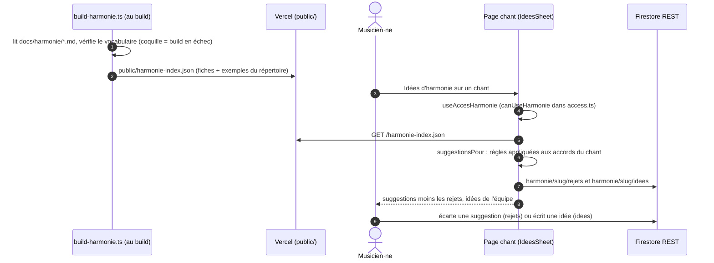
```mermaid
sequenceDiagram
  autonumber
  participant B as build-harmonie.ts (au build)
  participant V as Vercel (public/)
  actor U as Musicien·ne
  participant D as Page chant (IdeesSheet)
  participant FS as Firestore REST
  B->>B: lit docs/harmonie/*.md, vérifie le vocabulaire (coquille = build en échec)
  B->>V: public/harmonie-index.json (fiches + exemples du répertoire)
  U->>D: Idées d'harmonie sur un chant
  D->>D: useAccesHarmonie (canUseHarmonie dans access.ts)
  D->>V: GET /harmonie-index.json
  D->>D: suggestionsPour : règles appliquées aux accords du chant
  D->>FS: harmonie/slug/rejets et harmonie/slug/idees
  D-->>U: suggestions moins les rejets, idées de l'équipe
  U->>FS: écarte une suggestion (rejets) ou écrit une idée (idees)
```

[SVG](diagrammes/26-harmonie.svg)

## Modèle de données

### Un chant

Un chant n'est pas en base : c'est un fichier .cho, analysé en arbre (sections, lignes, jetons accord ou paroles). Au build, un résumé de chaque chant part dans songs-index.json. Les partitions 简谱 sont à part, dans public/jianpu : pages WebP et calque des accords.

**Fichiers clés** : `src/types/song.ts`, `src/types/chordPro.ts`, `src/lib/chordpro/parser.ts`, `src/lib/content/loadSongs.ts`, `content/themes.json`, `src/lib/jianpu/images.ts`

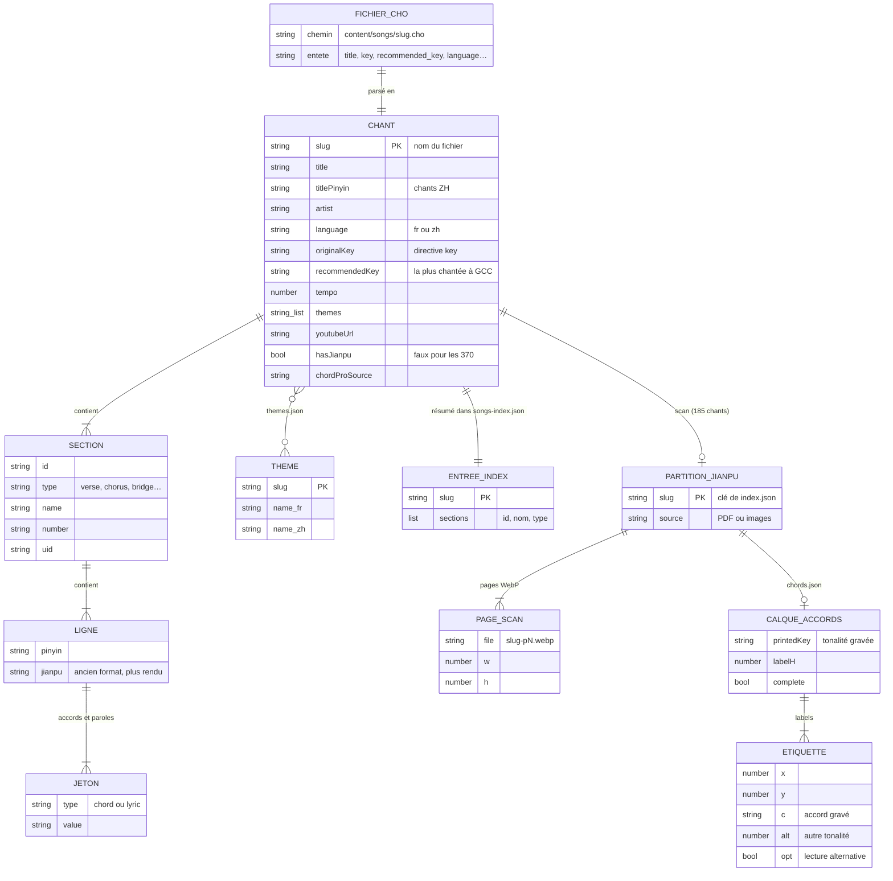
```mermaid
erDiagram
  FICHIER_CHO ||--|| CHANT : "parsé en"
  CHANT ||--|{ SECTION : contient
  SECTION ||--|{ LIGNE : contient
  LIGNE ||--|{ JETON : "accords et paroles"
  CHANT }o--o{ THEME : "themes.json"
  CHANT ||--|| ENTREE_INDEX : "résumé dans songs-index.json"
  CHANT ||--o| PARTITION_JIANPU : "scan (185 chants)"
  PARTITION_JIANPU ||--|{ PAGE_SCAN : "pages WebP"
  PARTITION_JIANPU ||--o| CALQUE_ACCORDS : "chords.json"
  CALQUE_ACCORDS ||--|{ ETIQUETTE : labels
  FICHIER_CHO {
    string chemin "content/songs/slug.cho"
    string entete "title, key, recommended_key, language…"
  }
  CHANT {
    string slug PK "nom du fichier"
    string title
    string titlePinyin "chants ZH"
    string artist
    string language "fr ou zh"
    string originalKey "directive key"
    string recommendedKey "la plus chantée à GCC"
    number tempo
    string_list themes
    string youtubeUrl
    bool hasJianpu "faux pour les 370"
    string chordProSource
  }
  SECTION {
    string id
    string type "verse, chorus, bridge…"
    string name
    string number
    string uid
  }
  LIGNE {
    string pinyin
    string jianpu "ancien format, plus rendu"
  }
  JETON {
    string type "chord ou lyric"
    string value
  }
  THEME {
    string slug PK
    string name_fr
    string name_zh
  }
  ENTREE_INDEX {
    string slug PK
    list sections "id, nom, type"
  }
  PARTITION_JIANPU {
    string slug PK "clé de index.json"
    string source "PDF ou images"
  }
  PAGE_SCAN {
    string file "slug-pN.webp"
    number w
    number h
  }
  CALQUE_ACCORDS {
    string printedKey "tonalité gravée"
    number labelH
    bool complete
  }
  ETIQUETTE {
    number x
    number y
    string c "accord gravé"
    number alt "autre tonalité"
    bool opt "lecture alternative"
  }
```

[SVG](diagrammes/30-donnees-chant.svg)

### Setlists, comptes et travail autour des chants

Une setlist est un seul document Firestore : ses chants forment un tableau, chacun avec tonalité, structure, notes, nuances et parfois une source ChordPro adaptée. L'historique et les versions perso sont des sous-collections. Les chants sont désignés par leur slug, sans lien vérifié par la base.

**Fichiers clés** : `src/lib/firebase/setlists.ts`, `src/types/setList.ts`, `src/types/user.ts`, `src/lib/firebase/setlistHistory.ts`, `src/lib/firebase/setlistVersions.ts`, `src/lib/firebase/annotations.ts`, `src/lib/firebase/harmonie.ts`, `firestore.rules`

> **Incertain** : Champs principaux seulement, relevés dans les types et les fonctions fromFs* : Firestore n'impose pas de schéma.

```mermaid
erDiagram
  USERS ||--o{ SETLISTS : "ownerId"
  SETLISTS ||--|{ SETLIST_ITEM : "items (tableau)"
  SETLIST_ITEM }o--|| CHANT : "songSlug"
  SETLISTS ||--o{ HISTORY : "sous-collection history"
  SETLISTS ||--o{ VERSIONS : "sous-collection versions"
  USERS ||--o{ VERSIONS : "une par personne"
  USERS ||--o{ ANNOTATIONS : "userId dans l'id"
  SETLISTS ||--o{ ANNOTATIONS : "setlistId dans l'id"
  CHANT ||--o{ HARMONIE_IDEE : "harmonie/slug/idees"
  CHANT ||--o{ HARMONIE_REJET : "harmonie/slug/rejets"
  USERS ||--o{ SONG_PROPOSALS : "authorId"
  USERS ||--o{ REPORTS : "authorId"
  USERS {
    string uid PK
    string email
    string firstName
    string lastName
    string planningName "lien avec le Sheet"
    map serviceRoles "catégorie → rôles"
    string_list notify "audiences autorisées"
    string_list poles
    string_list plannings "droits d'écriture"
    bool equipes
  }
  SETLISTS {
    string id PK
    string title
    string leader
    string category "culte, groupe, EDD…"
    string date
    string moment "matin ou soir"
    string language "fr, zh ou mixed"
    bool isDraft
    bool isPrivate
    string ownerId FK
    string presentationUrl
    timestamp createdAt
    timestamp updatedAt
  }
  SETLIST_ITEM {
    string type "chant, fusion ou transition"
    string songSlug FK
    string keyOverride
    string_list structureOverride
    map sectionNotes
    map sectionNuances
    map sectionKeys
    string contentOverride "mode Adapter"
    bool useJianpu
    map jianpuChords "retouches du calque"
    list fusionSongs
  }
  HISTORY {
    string id PK "heure-uid"
    string authorUid
    string authorName
    timestamp at
    list changes
  }
  VERSIONS {
    string uid PK
    string authorName
    map items "content, structure, shared"
    map choices
  }
  ANNOTATIONS {
    string id PK "userId__setlistId__page"
    string strokes "traits en JSON"
  }
  CHANT {
    string slug PK "fichier .cho, hors Firestore"
  }
  HARMONIE_IDEE {
    string uid
    string instrument
    string texte
    string ficheId
  }
  HARMONIE_REJET {
    string suggestion
    string uid
  }
  SONG_PROPOSALS {
    string title
    string youtubeUrl
    string pdfUrl
    string status
    string authorId FK
  }
  REPORTS {
    string kind "song ou site"
    string title
    string songSlug
    string status
    string authorId FK
  }
```

[SVG](diagrammes/31-donnees-louange.svg)

### Notifications

Chaque appareil abonné est un document ; les préférences et la langue des envois sont dans notifPrefs. notifLog empêche les doublons, et notifications alimente la cloche pour les envois qui n'ont pas d'autre trace.

**Fichiers clés** : `src/lib/push/client.ts`, `src/lib/push/send.ts`, `src/lib/push/notifications.ts`, `src/lib/firebase/notifPrefs.ts`, `src/lib/firebase/onboarding.ts`, `src/app/api/planning/release/route.ts`

```mermaid
erDiagram
  USERS ||--o{ PUSH_SUBSCRIPTIONS : "un par appareil"
  USERS ||--o| NOTIF_PREFS : "notifPrefs/uid"
  USERS ||--o{ NOTIFICATIONS : "recipients"
  USERS ||--o{ NOTIF_LOG : "anti-doublon des rappels"
  SETLISTS ||--o| NOTIF_LOG : "setlist-id"
  USERS ||--o| ONBOARDING : "accueil vu"
  USERS {
    string uid PK
  }
  SETLISTS {
    string id PK
  }
  PUSH_SUBSCRIPTIONS {
    string id PK "uid__sha256(endpoint)"
    string uid FK
    string endpoint
    string p256dh
    string auth
    string ua
    string createdAt
  }
  NOTIF_PREFS {
    string uid PK
    bool reminders
    bool setlists
    bool evenements
    bool taches
    string lang "fr ou zh-CN"
  }
  NOTIFICATIONS {
    string kind "manual, reminder, broadcast…"
    string title
    string body
    string url
    string_list recipients
    bool everyone
    timestamp createdAt
  }
  NOTIF_LOG {
    string id PK "par envoi : setlist, échéance…"
    number lastSentAt
    number recipients
  }
  ONBOARDING {
    string uid PK
  }
  PLANNING_RELEASES {
    string id PK "clé_année"
    string_list published "trimestres visibles"
  }
```

[SVG](diagrammes/32-donnees-notifications.svg)

### Back-office

Évènements et inscriptions, programmes de scène, tâches par pôle, équipes, grilles de planning. Ces collections sont partagées entre le local et la production, qui utilisent le même projet Firestore.

**Fichiers clés** : `src/types/evenement.ts`, `src/types/programme.ts`, `src/types/tache.ts`, `src/types/equipe.ts`, `src/lib/firebase/planningGrille.ts`, `firestore.rules`

```mermaid
erDiagram
  USERS ||--o{ EVENEMENTS : "organisateurUid"
  EVENEMENTS ||--o{ INSCRIPTIONS : "sous-collection"
  USERS |o--o{ INSCRIPTIONS : "uid, ou sans compte"
  PROGRAMMES ||--o{ CRENEAUX : "sous-collection"
  POLES ||--o{ TACHES : "poles/pole/taches"
  TACHES ||--o{ FOIS : "fois/date"
  TACHES }o--o| EVENEMENTS : "evenement lié"
  EQUIPES }o--o| POLES : "pole"
  PLANNINGS ||--o{ DIMANCHES : "dimanches/date"
  PLANNINGS ||--o{ PLANNING_HISTORY : "history"
  USERS {
    string uid PK
    string_list poles
    string_list plannings
  }
  EVENEMENTS {
    string id PK
    string titre
    string type
    string pour "église, section ou pôle"
    string date
    string lieu
    number placesMax
    string inscriptions "automatique, ouvertes, fermées"
    bool sansCompte
    string lienExterne
    number inscrits
  }
  INSCRIPTIONS {
    string id PK "uid ou aléatoire"
    string nom
    number invites "0 à 5"
    string createdAt
  }
  PROGRAMMES {
    string id PK
    string nom
    string jourJ
    bool visible
    list passages "quoi, qui, titre"
  }
  CRENEAUX {
    string dimanche
    string debut
    string fin
    string quoi
    string_list qui
  }
  POLES {
    string pole PK
  }
  TACHES {
    string titre
    string responsableUid
    string echeance
    map repetition "semaine, mois, an…"
    map prevenir
  }
  FOIS {
    string date PK
    string etat "encours ou terminee"
    string parNom
  }
  EQUIPES {
    string id PK
    list membres "nom, uid, référent, essai"
  }
  PLANNINGS {
    string key PK "culte, groupes…"
  }
  DIMANCHES {
    string date PK
    map colonnes "un champ par colonne"
  }
  PLANNING_HISTORY {
    string id PK
  }
```

[SVG](diagrammes/33-donnees-back-office.svg)

## Dépendances du code

### Les grandes zones

Qui importe qui, par grandes zones du dépôt, imports de type compris. Chaque nombre compte des imports. Les pages s'appuient sur les composants, qui s'appuient sur src/lib ; les scripts de build réutilisent le parseur de l'app.

**Fichiers clés** : `scripts/diagrammes/generer.ts`, `tsconfig.json`

```mermaid
%% Généré par scripts/diagrammes/generer.ts (dependency-cruiser). Ne pas modifier à la main.
flowchart LR
  n0["scripts (build)<br/>7 fichiers"]
  n1["scripts/jianpu<br/>4 fichiers"]
  n2["src/app (pages)<br/>75 fichiers"]
  n3["src/app/api<br/>17 fichiers"]
  n4["src/components<br/>76 fichiers"]
  n5["src/hooks<br/>5 fichiers"]
  n6["src/lib<br/>117 fichiers"]
  n7["src/locales<br/>2 fichiers"]
  n8["src/types<br/>14 fichiers"]
  n9["tests<br/>2 fichiers"]
  n0 -->|14| n6
  n0 -->|5| n8
  n1 -->|1| n6
  n1 -->|7| n9
  n2 ==>|174| n4
  n2 -->|5| n5
  n2 ==>|312| n6
  n2 -->|47| n8
  n3 ==>|108| n6
  n3 -->|13| n8
  n4 -->|15| n5
  n4 ==>|179| n6
  n4 -->|4| n7
  n4 -->|31| n8
  n5 -->|6| n6
  n6 -->|2| n7
  n6 ==>|71| n8
```

[SVG](diagrammes/40-dependances-couches.svg)

### Entre les modules de src/lib

Les dossiers de src/lib entre eux, imports de type exclus. firebase/setlists.ts sert de client REST à presque tous les autres, d'où les flèches qui convergent vers firebase. Les dossiers sans aucun lien avec les autres ne sont pas dessinés.

**Fichiers clés** : `src/lib/`, `src/lib/firebase/setlists.ts`

```mermaid
%% Généré par scripts/diagrammes/generer.ts (dependency-cruiser). Ne pas modifier à la main.
flowchart LR
  n0["lib/(racine)<br/>15 fichiers"]
  n1["lib/api<br/>1 fichier"]
  n2["lib/chordpro<br/>7 fichiers"]
  n3["lib/content<br/>1 fichier"]
  n4["lib/equipes<br/>3 fichiers"]
  n5["lib/evenements<br/>5 fichiers"]
  n6["lib/firebase<br/>20 fichiers"]
  n7["lib/harmonie<br/>9 fichiers"]
  n8["lib/jianpu<br/>4 fichiers"]
  n9["lib/pdf<br/>2 fichiers"]
  n10["lib/performance<br/>1 fichier"]
  n11["lib/planning<br/>12 fichiers"]
  n12["lib/push<br/>8 fichiers"]
  n13["lib/scene<br/>4 fichiers"]
  n14["lib/setlist<br/>12 fichiers"]
  n15["lib/taches<br/>5 fichiers"]
  n0 -->|1| n11
  n1 -->|1| n2
  n2 -->|1| n0
  n3 -->|1| n2
  n4 -->|1| n0
  n4 -->|1| n5
  n4 -->|3| n11
  n4 -->|1| n12
  n5 -->|2| n0
  n5 -->|2| n6
  n5 -->|3| n12
  n5 -->|1| n15
  n6 -->|1| n5
  n6 -->|2| n11
  n6 -->|1| n14
  n7 -->|6| n0
  n7 -->|1| n2
  n7 -->|1| n6
  n7 -->|1| n11
  n8 -->|1| n0
  n9 -->|1| n2
  n9 -->|3| n14
  n10 -->|2| n0
  n10 -->|2| n2
  n10 -->|1| n8
  n10 -->|1| n14
  n11 -->|2| n0
  n11 -->|1| n6
  n11 -->|1| n12
  n12 -->|2| n0
  n12 -->|1| n6
  n12 -->|3| n11
  n13 -->|1| n6
  n13 -->|1| n12
  n14 -->|1| n0
  n14 -->|8| n2
  n14 -->|1| n11
  n15 -->|1| n0
  n15 -->|2| n6
  n15 -->|2| n12
```

[SVG](diagrammes/41-dependances-lib.svg)

### Composants

Les dossiers de src/components entre eux, et vers src/lib et src/hooks regroupés. Imports de type exclus.

**Fichiers clés** : `src/components/`, `src/hooks/`

```mermaid
%% Généré par scripts/diagrammes/generer.ts (dependency-cruiser). Ne pas modifier à la main.
flowchart LR
  subgraph C0["src/components"]
    n0["components/admin<br/>1 fichier"]
    n1["components/auth<br/>2 fichiers"]
    n2["components/customPanel<br/>1 fichier"]
    n3["components/evenements<br/>4 fichiers"]
    n4["components/guide<br/>2 fichiers"]
    n5["components/harmonie<br/>5 fichiers"]
    n6["components/jianpu<br/>3 fichiers"]
    n7["components/layout<br/>7 fichiers"]
    n8["components/onboarding<br/>1 fichier"]
    n9["components/pdf<br/>6 fichiers"]
    n10["components/performance<br/>2 fichiers"]
    n11["components/planning<br/>7 fichiers"]
    n12["components/push<br/>2 fichiers"]
    n13["components/report<br/>1 fichier"]
    n14["components/setlists<br/>7 fichiers"]
    n15["components/song<br/>6 fichiers"]
    n16["components/songs<br/>1 fichier"]
    n17["components/taches<br/>3 fichiers"]
    n18["components/ui<br/>15 fichiers"]
  end
  subgraph C1["Modules partagés"]
    n19["src/hooks<br/>5 fichiers"]
    n20["src/lib<br/>117 fichiers"]
  end
  n0 -->|1| n20
  n1 -->|2| n18
  n1 -->|5| n20
  n2 -->|2| n20
  n3 -->|1| n7
  n3 -->|4| n18
  n3 -->|11| n20
  n4 -->|1| n20
  n5 -->|2| n18
  n5 -->|1| n19
  n5 -->|13| n20
  n6 -->|1| n14
  n6 -->|1| n15
  n6 -->|1| n18
  n6 -->|1| n19
  n6 -->|5| n20
  n7 -->|1| n13
  n7 -->|2| n18
  n7 -->|6| n19
  n7 -->|9| n20
  n8 -->|1| n18
  n8 -->|4| n20
  n9 -->|2| n18
  n9 -->|1| n19
  n9 -->|19| n20
  n10 -->|2| n6
  n10 -->|2| n15
  n10 -->|3| n18
  n10 -->|13| n20
  n11 -->|2| n7
  n11 -->|1| n9
  n11 -->|15| n20
  n12 -->|2| n18
  n12 -->|5| n20
  n13 -->|3| n20
  n14 -->|1| n15
  n14 -->|10| n18
  n14 -->|4| n19
  n14 -->|25| n20
  n16 -->|3| n18
  n15 -->|8| n20
  n16 -->|1| n19
  n16 -->|2| n20
  n17 -->|3| n18
  n17 -->|1| n19
  n17 -->|3| n20
  n18 -->|15| n20
```

[SVG](diagrammes/42-dependances-composants.svg)

### Routes API

Ce que chaque groupe de routes API importe dans src/lib : la partie serveur du site. Presque tout passe par push/admin.ts, qui initialise Firebase Admin.

**Fichiers clés** : `src/app/api/`, `src/lib/push/admin.ts`

```mermaid
%% Généré par scripts/diagrammes/generer.ts (dependency-cruiser). Ne pas modifier à la main.
flowchart LR
  subgraph C0["Routes API"]
    n0["/api/admin<br/>1 fichier"]
    n1["/api/cron<br/>1 fichier"]
    n2["/api/equipes<br/>2 fichiers"]
    n3["/api/evenements<br/>2 fichiers"]
    n4["/api/planning<br/>1 fichier"]
    n5["/api/push<br/>4 fichiers"]
    n6["/api/report<br/>1 fichier"]
    n7["/api/scene<br/>1 fichier"]
    n8["/api/setlist<br/>1 fichier"]
    n9["/api/song<br/>1 fichier"]
    n10["/api/taches<br/>2 fichiers"]
  end
  subgraph C1["src/lib"]
    n11["lib/(racine)<br/>15 fichiers"]
    n12["lib/content<br/>1 fichier"]
    n13["lib/equipes<br/>3 fichiers"]
    n14["lib/evenements<br/>5 fichiers"]
    n15["lib/planning<br/>12 fichiers"]
    n16["lib/push<br/>8 fichiers"]
    n17["lib/report<br/>2 fichiers"]
    n18["lib/scene<br/>4 fichiers"]
    n19["lib/setlist<br/>12 fichiers"]
    n20["lib/taches<br/>5 fichiers"]
  end
  n0 -->|2| n11
  n0 -->|1| n14
  n0 -->|5| n15
  n0 -->|2| n16
  n1 -->|2| n11
  n1 -->|2| n14
  n1 -->|1| n15
  n1 -->|5| n16
  n1 -->|2| n18
  n1 -->|2| n20
  n2 -->|2| n11
  n2 -->|3| n13
  n2 -->|2| n14
  n2 -->|1| n15
  n2 -->|2| n16
  n3 -->|3| n11
  n3 -->|4| n14
  n3 -->|2| n16
  n4 -->|1| n11
  n4 -->|1| n15
  n4 -->|6| n16
  n5 -->|4| n11
  n5 -->|2| n14
  n5 -->|1| n15
  n5 ==>|15| n16
  n6 -->|3| n16
  n6 -->|1| n17
  n7 -->|1| n11
  n7 -->|4| n16
  n7 -->|2| n18
  n8 -->|1| n11
  n8 -->|1| n15
  n8 -->|4| n16
  n8 -->|1| n19
  n9 -->|1| n12
  n10 -->|2| n11
  n10 -->|1| n15
  n10 -->|7| n16
  n10 -->|5| n20
```

[SVG](diagrammes/43-dependances-api.svg)

## Points incertains

- Déploiement : le déclenchement par l'intégration Git de Vercel, et le fait qu'une CI rouge n'empêche pas la mise en ligne, sont déduits ; rien dans le dépôt ne le décrit.
- Tâches, équipes et programmes de scène n'ont pas de diagramme de séquence : ils sont coupés en ligne et n'apparaissent ici que dans le modèle de données du back-office et dans les dépendances.
- Modèles de données : champs principaux seulement. Firestore n'impose pas de schéma, un document ancien peut porter des champs qui n'y figurent pas.
- Conversion d'un chant proposé en .cho : pratique manuelle, absente du code.
- Pipeline 简谱 : les scans sources sont hors du dépôt, les étapes amont ne se vérifient pas depuis un clone.
- Graphes de dépendances : les import() dynamiques (PDF à la demande) comptent comme des imports ordinaires ; les modules de node_modules sont exclus.

## Bizarreries repérées

- **Un jeton Google suivi par git** (sécurité) : token.pickle contient des identifiants OAuth Google (portée drive.readonly) et est commité depuis 5129cfa. Si le dépôt est public ou partagé, révoquer ce jeton dans le compte Google, puis le retirer du suivi, et de l'historique si besoin.
- **Resend : dans la doc, pas dans le code** (doc périmée) : CLAUDE.md annonce des signalements par email via Resend. Aucun code n'envoie d'email et Resend n'est pas dans package.json : /api/report écrit dans Firestore et envoie un push aux admins.
- **17 routes API, pas 18** (doc périmée) : CLAUDE.md cite /api/admin/migrer-annonces, qui n'existe plus.
- **songs-index.json ne sert pas à la liste** (doc périmée) : La doc dit que la liste et la recherche lisent songs-index.json ; en réalité /songs reçoit les chants au build. L'index sert à l'éditeur et à la page d'une setlist, et à Harmonie.
- **Un détour par chant dans une setlist** (performance) : Avec trailingSlash: true, /api/song/slug redirige vers /api/song/slug/ (308, vérifié en ligne). fetchSongAST appelle l'adresse sans barre finale : un aller-retour de plus pour chaque chant de la vue Partitions.
- **Le client REST de Firestore s'appelle setlists.ts** (structure) : FS_BASE, authHeader et toFsFields vivent dans src/lib/firebase/setlists.ts et sont importés par 30 fichiers, push et évènements compris ; annotations.ts en garde sa propre copie. L'identifiant du projet Firebase est écrit en dur dans 7 fichiers, alors que la config Firebase le reçoit d'ailleurs.
- **Firebase Admin rangé dans push/** (structure) : src/lib/push/admin.ts initialise l'Admin SDK pour 14 routes API, dont beaucoup n'envoient aucun push. Le même dossier mélange modules serveur (admin.ts, send.ts) et module navigateur (client.ts) : seul un commentaire empêche d'importer les premiers côté client.
- **Hors ligne, le live n'est pas garanti** (hors-ligne) : Le service worker n'écrit jamais en cache les setlists (Firestore) ni les scans 简谱 (/jianpu/*). Une setlist qui n'était pas ouverte avant la coupure ne s'affiche pas, ses scans non plus.
- **L'app installée démarre là où rien n'est préchargé** (hors-ligne) : start_url vaut /planning, mais l'installation ne précharge que /songs/ et l'index des chants : un premier lancement hors ligne retombe sur /songs/.
- **Du code mort visible** (code mort) : hasJianpu vaut faux pour les 370 chants (le format {jianpu:} en ligne n'est plus utilisé) et n'est lu nulle part ; le type Setlist de src/types/setList.ts n'est importé nulle part, c'est FSSetlist qui sert.
- **Des fichiers générés aussi commités** (structure) : songs-index.json, harmonie-index.json et glyphWidths.json sont recréés à chaque build mais suivis par git : ils divergent dès qu'un .cho est poussé sans les régénérer.
- **Pipeline 简谱 sans liste de dépendances** (outillage) : Les scripts Python s'appuient sur Pillow et NumPy, sans requirements.txt pour les installer.
- **Un nom de fichier à part** (contenu) : content/songs/Ta parole.cho est le seul fichier avec une espace et une majuscule ; son slug les garde dans l'URL.
